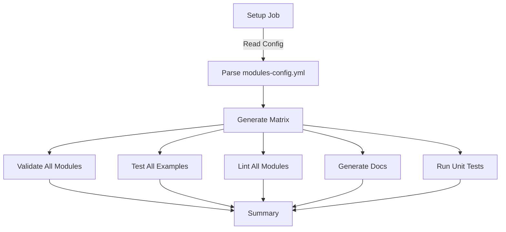

# 🚀 Scalable Terraform CI/CD Pipeline

## Overview

This pipeline uses a **data-driven, dynamic matrix strategy** to automatically scale across multiple Terraform modules without manual workflow updates.

---

## 🎯 Key Features

✅ **Auto-Discovery** - Modules defined in configuration file  
✅ **Dynamic Matrix** - Automatically creates jobs for all modules/examples  
✅ **Zero Hardcoding** - No need to edit workflow when adding modules  
✅ **Selective Testing** - Enable/disable modules via config  
✅ **Scalable** - Handles 2 or 200 modules with same workflow  

---

## 📁 Architecture

### Configuration-Driven Approach

```
.github/
├── modules-config.yml                    # 📝 Module definitions (EDIT THIS)
└── workflows/
    ├── terraform-ci-scalable.yml         # 🎯 Main pipeline (uses config)
    └── template/                         # 📁 Workflow templates
        ├── validate-module.yml           # Validation workflow
        ├── test-example.yml              # Example testing workflow
        ├── lint-module.yml               # Linting workflow
        ├── generate-docs.yml             # Documentation workflow
        └── unit-tests.yml                # Unit testing workflow
```

---

## 📝 Configuration File (`modules-config.yml`)

### Structure

```yaml
modules:
  - name: terraform-azurerm-avm-res-storage-storageaccount-main
    enabled: true              # Enable/disable this module
    has_unit_tests: false      # Does this module have unit tests?
    examples:                  # List of examples to test
      - default
      - customer-managed-key
      - data_lake_gen2

  - name: terraform-azurerm-avm-res-keyvault-vault-main
    enabled: true
    has_unit_tests: true
    examples:
      - default
      - access-policies
      - create-key
```

### Configuration Options

| Field | Type | Required | Description |
|-------|------|----------|-------------|
| `name` | string | Yes | Module directory name |
| `enabled` | boolean | Yes | Enable/disable module testing |
| `has_unit_tests` | boolean | Yes | Whether module has `.tftest.hcl` files |
| `examples` | array | Yes | List of example directory names |

---

## 🚀 Adding a New Module

### Step 1: Add Module Configuration

Edit `.github/modules-config.yml`:

```yaml
modules:
  - name: terraform-azurerm-avm-res-newmodule-main
    enabled: true
    has_unit_tests: true
    examples:
      - default
      - advanced
      - with-networking
```

### Step 2: That's It! 🎉

The pipeline automatically:
- ✅ Validates the module
- ✅ Tests all examples (3 in this case)
- ✅ Runs linting
- ✅ Generates documentation
- ✅ Runs unit tests (if `has_unit_tests: true`)

**No workflow changes needed!**

---

## 🔄 Pipeline Flow



### Pipeline Stages

1. **Setup** (Dynamic)
   - Reads `modules-config.yml`
   - Generates dynamic matrices for all jobs
   - Outputs: enabled modules, examples, modules with tests

2. **Validate** (Matrix)
   - Uses module matrix from setup
   - Runs in parallel for all enabled modules

3. **Test Examples** (Matrix)
   - Uses examples matrix from setup
   - Tests all module-example combinations in parallel

4. **Lint** (Matrix)
   - Uses module matrix from setup
   - Lints all enabled modules

5. **Documentation** (Matrix)
   - Uses module matrix from setup
   - Generates docs for all enabled modules

6. **Unit Tests** (Matrix)
   - Uses modules-with-tests matrix from setup
   - Only runs for modules with `has_unit_tests: true`

7. **Summary**
   - Displays test coverage
   - Shows pass/fail for each stage

---

## 📊 Comparison: Old vs New

### ❌ Old Approach (main-pipeline.yml)

```yaml
jobs:
  validate-storage:
    uses: ./.github/workflows/validate-module.yml
    with:
      module_name: terraform-azurerm-avm-res-storage-storageaccount-main
  
  validate-keyvault:
    uses: ./.github/workflows/validate-module.yml
    with:
      module_name: terraform-azurerm-avm-res-keyvault-vault-main
  
  # ... 50+ more job definitions for examples ...
```

**Problems:**
- ❌ Manual job creation for each module
- ❌ Workflow grows exponentially with modules
- ❌ Hard to maintain
- ❌ Risk of copy-paste errors

### ✅ New Approach (terraform-ci-scalable.yml)

```yaml
jobs:
  setup:
    # Reads modules-config.yml dynamically
  
  validate:
    strategy:
      matrix:
        module: ${{ fromJson(needs.setup.outputs.modules) }}
    uses: ./.github/workflows/validate-module.yml
    with:
      module_name: ${{ matrix.module }}
```

**Benefits:**
- ✅ Single job definition
- ✅ Scales automatically
- ✅ Easy to maintain
- ✅ No duplication

---

## 🎯 Real-World Scaling Example

### Scenario: Add 10 New Modules

#### Old Approach
```
Edit workflow file:
- Add 10 validate jobs
- Add ~60 example test jobs (6 examples per module)
- Add 10 lint jobs
- Add 10 docs jobs
- Add unit test jobs
- Update summary dependencies
= ~90 job definitions to add manually
```

#### New Approach
```
Edit modules-config.yml:
- Add 10 module entries

= Done! Pipeline auto-scales
```

---

## 🔧 Advanced Usage

### Temporarily Disable a Module

```yaml
- name: terraform-azurerm-avm-res-storage-storageaccount-main
  enabled: false  # ← Just set to false
  has_unit_tests: false
  examples:
    - default
```

### Skip Specific Examples

```yaml
- name: terraform-azurerm-avm-res-keyvault-vault-main
  enabled: true
  has_unit_tests: true
  examples:
    - default
    # - create-key  ← Comment out to skip
    - create-secret
```

### Module Without Unit Tests

```yaml
- name: terraform-azurerm-avm-res-network-main
  enabled: true
  has_unit_tests: false  # ← No unit tests for this module
  examples:
    - default
```

### Module With Many Examples

```yaml
- name: terraform-azurerm-avm-res-compute-vm-main
  enabled: true
  has_unit_tests: true
  examples:
    - default
    - windows
    - linux
    - with-load-balancer
    - with-backup
    - with-monitoring
    - high-availability
    - spot-instances
    # ... add as many as needed
```

---

## 📈 Performance & Limits

### GitHub Actions Limits

| Limit | Value | Impact |
|-------|-------|--------|
| Max jobs per workflow | 256 | Can test ~85 modules with 3 examples each |
| Max matrix combinations | 256 | Plenty for most scenarios |
| Concurrent jobs (free) | 20 | Examples test in batches |
| Concurrent jobs (paid) | 60-180 | Faster parallel execution |

### Current Pipeline

With 2 modules:
- **Jobs Created:** ~25 (2 validate + 17 examples + 2 lint + 2 docs + 1 unit test + 1 summary)
- **Execution Time:** ~5-10 minutes (parallel)

With 10 modules (avg 6 examples each):
- **Jobs Created:** ~82 (10 validate + 60 examples + 10 lint + 10 docs + unit tests + summary)
- **Execution Time:** ~8-15 minutes (parallel execution)

---

## 🔍 Debugging

### View Generated Matrices

Check the "Setup" job logs to see what matrices were generated:

```
Modules to test: ["module1", "module2", "module3"]
Examples to test: [{"module":"module1","example":"default"}, ...]
Modules with unit tests: ["module2"]
```

### Common Issues

#### No jobs running
- Check if modules are `enabled: true`
- Verify YAML syntax in `modules-config.yml`

#### Skipped unit tests
- Ensure `has_unit_tests: true` for modules with tests
- Check that tests exist in `modules/<name>/tests/`

#### Matrix parsing errors
- Validate YAML syntax (use a YAML linter)
- Ensure all required fields are present

---

## 🎓 Best Practices

### 1. Keep Configuration Updated
Update `modules-config.yml` when:
- Adding/removing modules
- Adding/removing examples
- Adding unit tests to existing modules

### 2. Use Meaningful Names
```yaml
# ✅ Good
examples:
  - default
  - with-private-endpoint
  - with-managed-identity

# ❌ Bad
examples:
  - example1
  - test2
  - ex3
```

### 3. Group Related Examples
```yaml
examples:
  # Basic scenarios
  - default
  - minimal
  
  # Advanced scenarios
  - with-networking
  - with-security
  - with-monitoring
```

### 4. Disable Instead of Delete
```yaml
# Keep history, easy to re-enable
- name: legacy-module
  enabled: false  # ← Don't delete, just disable
  has_unit_tests: true
  examples:
    - default
```

---

## 🔄 Migration Guide

### From `main-pipeline.yml` to `terraform-ci-scalable.yml`

1. **Test the new pipeline:**
   ```bash
   # Trigger manually via GitHub Actions UI
   # Go to Actions → terraform-ci-scalable.yml → Run workflow
   ```

2. **Compare results:**
   - Both pipelines should produce same results
   - Check that all modules/examples are tested

3. **Switch over:**
   - Rename `main-pipeline.yml` → `main-pipeline.yml.backup`
   - Rename `terraform-ci-scalable.yml` → `main-pipeline.yml`
   - Or update branch protection rules to use new workflow

4. **Clean up (optional):**
   - Delete backup after verification
   - Remove old workflow references

---

## 💡 Future Enhancements

Possible additions to make it even more scalable:

### 1. Auto-Discovery from Filesystem
Generate config automatically by scanning `modules/` directory

### 2. Module Groups
```yaml
module_groups:
  compute:
    - vm
    - aks
  storage:
    - storage-account
    - keyvault
```

### 3. Conditional Testing
```yaml
- name: expensive-module
  enabled: true
  test_on_pr: false  # Skip on PRs, only on main
```

### 4. Custom Terraform Versions
```yaml
- name: legacy-module
  terraform_version: "1.5.0"  # Module-specific version
```

---

## 📚 Related Files

- `modules-config.yml` - Module definitions
- `terraform-ci-scalable.yml` - Main scalable pipeline
- `validate-module.yml` - Reusable validation workflow
- `test-example.yml` - Reusable example testing workflow
- `lint-module.yml` - Reusable linting workflow
- `generate-docs.yml` - Reusable docs workflow
- `unit-tests.yml` - Reusable unit test workflow

---

## 🎉 Summary

### Scalability Wins

| Aspect | Scalability |
|--------|-------------|
| **Add Module** | Edit 1 config file (6 lines) |
| **Add Example** | Add 1 line to config |
| **Disable Module** | Change `enabled: true` → `false` |
| **Workflow Maintenance** | Zero changes needed |
| **Testing Coverage** | Automatic for all enabled modules |

**The pipeline that scales with your infrastructure!** 🚀

---

**Ready to scale to hundreds of modules without workflow changes!**
